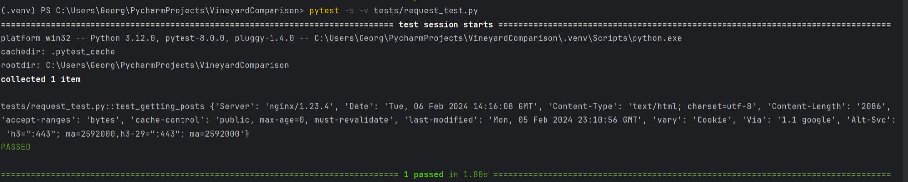
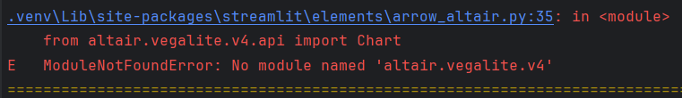

Перед непосредственным написанием тестов, мною была изучена вся структура программы с целью понимания её работы. 

Были установлены и изучены такие необходимые библиотеки для её работоспособности как : **_Streamlit, Earth Engine_**.

Изучена работа модулей: **_GEOJSON, Mock, Requests_**.

**Для выполнения задания тестирования были написаны тесты:**
* request_test.py
* cloud_test.py
* app_test.py
* data_test.py
* make_test.py

*В папке src/enum/global_enum содержатся маркеры валидации ошибок ко всем тестам.

***_configuration.py_** содержит в себе URl адрес сервиса.
## request_test.py
В этом тестировании проверяется работоспособность сервера.

Проверяем код ответа HTTP-статуса(если 200 - сервер работает)
>assert response.status_code == 200, GlobalErrorMessages.WRONG_STATUS_CODE.value

Также при изменении атрибута _response.---_ можно получить различную информацию от сервера. 

Например, прописанный 
>_response.headers_

возвращает заголовки сервера, которые он вернул во время ответа.

Работа теста:

## cloud_test.py
В этом тестировании проверяется работоспособность кода из файла _cloud.py_ - получение данных с клика по карте и работы библиотеки Earth Engine.

Проверка инициализации и аутентификации  Earth Engine.
>_def mock_st_secrets():_

Проверка получения параметров _sand, clay, orgc, elev, diurnal_.
>def test_get_data():

При первоначальном запуске теста получался конфиликт версий библиотеки _Altair_

Из-за чего пришлось прописать в _requirments.txt_

После чего данная ошибка была устранена
